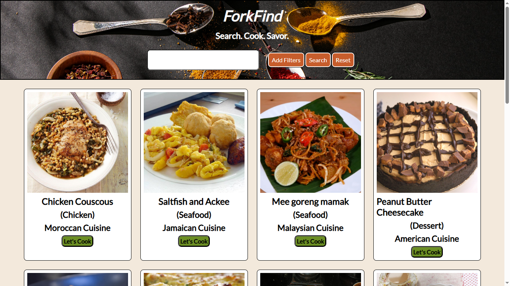
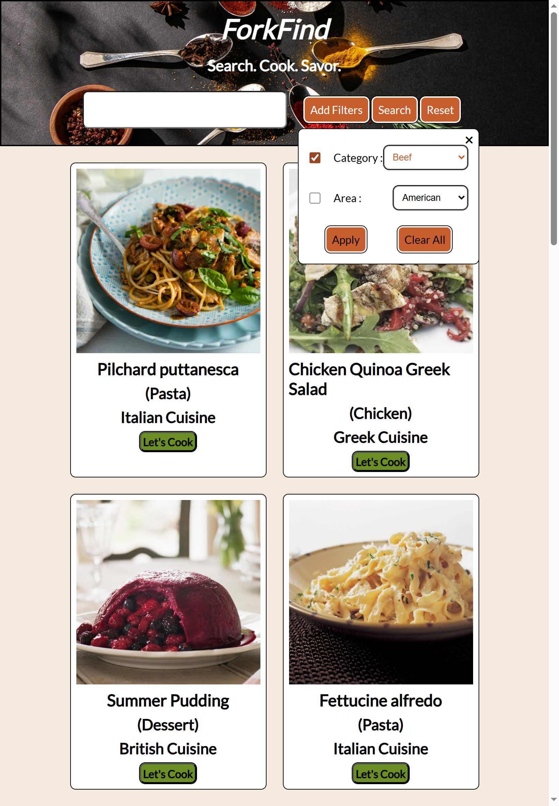

 # 🍽️ Recipe Finder 
    

**ForkFind** is a responsive web application that allows users to search and explore recipes by keywords or filters on category and area.It fetches real-time data from a public API and displays recipe details such as recipe name,images, ingredients, and instructions in a clean and user-friendly interface. Built using **HTML, CSS, and JavaScript**, this project focuses on **API integration**, DOM manipulation, and responsive design — without using any frameworks or libraries.


## 🎯 Purpose

This project was created to practice front-end development skills including responsive design, clean UI, and DOM manipulation. A key goal is to demonstrate API integration by fetching live recipe data from a public API using the Fetch API. The app handles real-time requests, displays a loading state, and gracefully manages network errors — offering a smooth user experience.


## 🚀 Live Demo (Change)

🔗 [View Live Site](www.google.com)
(Change)


## 📦 Tech Stack 
 
-  HTML5  
  
-  CSS3  
-  JavaScript  
- Fetch API


## 🔌 API Reference

This project uses the [TheMealDB API](https://www.themealdb.com/api.php) to fetch recipe data.


## ✨ Features

- Search recipes by keyword along with filetrs such as category,area of recipe
- View recipe name,images and its ingredients fetched from the API
- Modal popup shows ingredients and instructions without navigating away
- Displays a loading spinner while fetching recipes
- Handles network errors gracefully with user-friendly interfaces
- Responsive design for mobile/tablet
- Clean, modular CSS
- API integration for real recipe data


## 📸 Preview

Screen shots (Change)
<p align="center">
  
  
  
</p>


## 🧩 Project Structure

``` 
/ 
├── assets/ 
│   ├── desktop.png 
│   ├── mobile.png 
│   └── tablet.png 
├── images/ 
│   ├── bg-image.jpg 
│   └── fevicon.png 
├── index.html 
├── script.js 
├── style.css 
└── README.md 
``` 

## 📦 How to Use

1. Clone the repository

```bash
git clone https://github.com/sam8284/meal-search-app.git
```

2. Navigate to the project directory

```bash
cd meal-search-app
```
3. Run the App:
   Open the index.html file in your browser or use a live server (like VS Code Live Server extension) for better development experience.

```bash
open index.html
```

✅ No build tools or dependencies needed.

## Acknowledgement
- [Unsplash](https://unsplash.com/) for demo images
- [TheMealDB API](https://www.themealdb.com/api.php) to providing free recipe data

## 📬 Contact

[](mailto:saima.ansari8811@gmail.com)

[](https://www.linkedin.com/in/saima-ansari-developer/)


## 📄 License

This project is licensed under the MIT License. See the [MIT LICENSE](./LICENSE) file for more information.


